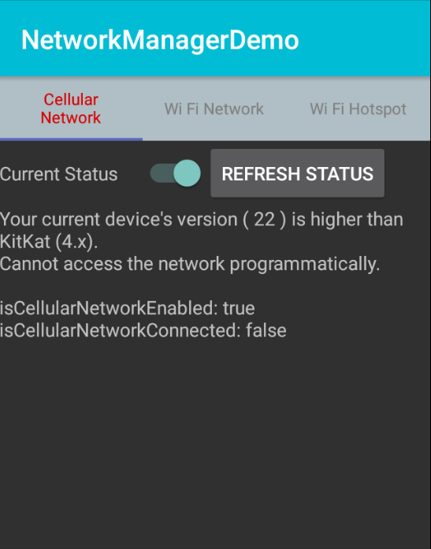
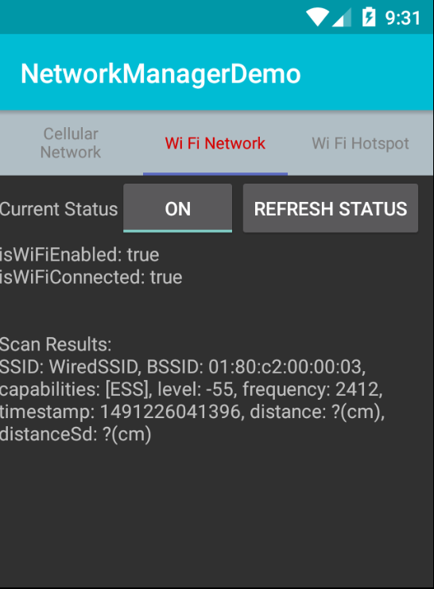
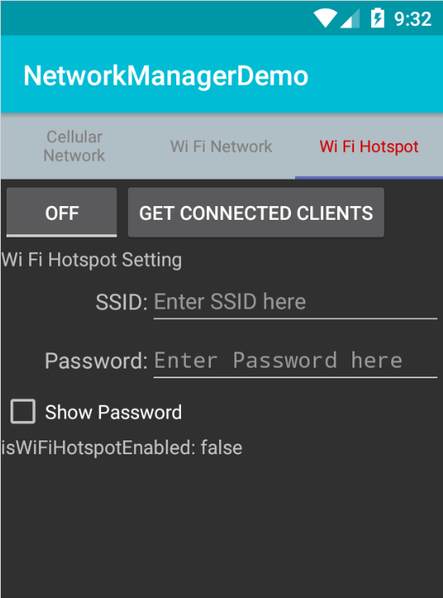

# Android-NetworkManager
Provides Cellular, Wi Fi, and Wi Fi Hotspot networks functions.
The network manager module is in "module" directory.
The demo app is in "app" directory.
***
Functions contain:

- Enable/Disable each network.
- Connect/Disconnect each network.
- Check each network's state. (e.g. Connected, Enabled, etc.)
- Get the Wi Fi connection information.
- Get the information of Wi Fi Hotspot's connected clients.
- Scan the nearby Wi Fi Hotspots and connect to any one of them.
- Get the device's MAC and IP address.
- Calculate approximate distance between the device and Wi Fi Hotspot.
- Etc.

**How to use: You can import the networkmanager module into your project** 
***

#### NOTE: Some functions may not work in the higher Android versions.

## Screenshots

### Cellular:

### Wi Fi:

### WiFi Hotspot:

